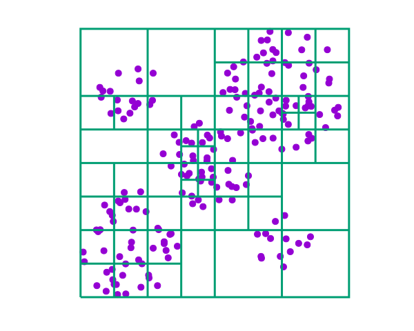
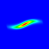
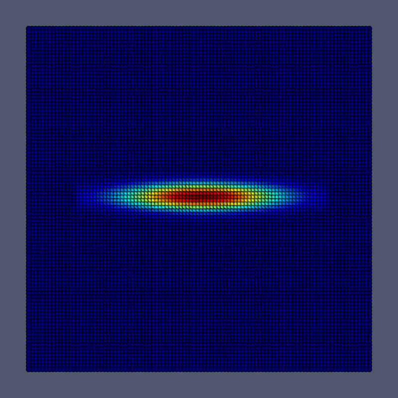
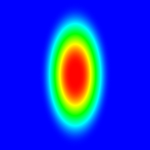

<h2>Dependencies</h2>

make, Fortran 77 compiler (tested with GNU Fortran, Intel, PGI, and HPE/Cray)

<h2>Build</h2>

By default uses GNU Fortran (edit [conf.mk](conf.mk) for other
compilers).

<pre>
; (cd lib && make)
; (cd example/gauss && make)
; (cd example/omegaI && make)
</pre>

<h2>Unit tests</h2>

<a href="example/unit/">example/unit</a>

<pre>
; make
; ./make_box.gp data/points
</pre>

<h2>Run</h2>

Elliptic <a href="https://en.wikipedia.org/wiki/Lamb%E2%80%93Oseen_vortex">Lamb–Oseen vortex</a>:

<pre>
; cd example/gauss
; ./main
 initial number of Particles        60025
           Particles :    60025      Time :  0.3405
           Time Step :        1      Time :  0.0010
           Particles :    60025      Time :  0.3257
           Time Step :        2      Time :  0.0020
           Particles :    60025      Time :  0.3263
           Time Step :        3      Time :  0.0030
           Particles :    60025      Time :  0.3295
           Time Step :        4      Time :  0.0040
           Particles :    60025      Time :  0.3317
           Time Step :        5      Time :  0.0050
 nx_l,nx_r        -114         114
 ny_t,ny_b         114        -114
 Nmesh =        52441
 ...
</pre>

<a href="https://doi.org/10.1017/S0022112087001150">Melander,  McWilliams,  and  Zabusky vortex</a>:

<pre>
; cd example/omegaI
; ./main
 initial number of Particles       672400
           Particles :   672400      Time : 12.1381
...
</pre>

<h2>Postprocessing</h2>

<pre>
; awk -f tool/heat.awk example/gauss/w.00000001.dat > heat.ppm
; convert heat.ppm heat.png
</pre>

 

<h2>Hacking</h2>

Needs <a href="https://www.ratrabbit.nl/ratrabbit/findent/index.html">findent</a>

<pre>
; for i in *.f; do findent -ofixed --indent_procedure=0 < $i > t && mv t $i; done
</pre>

<h2>Results</h2>

 

